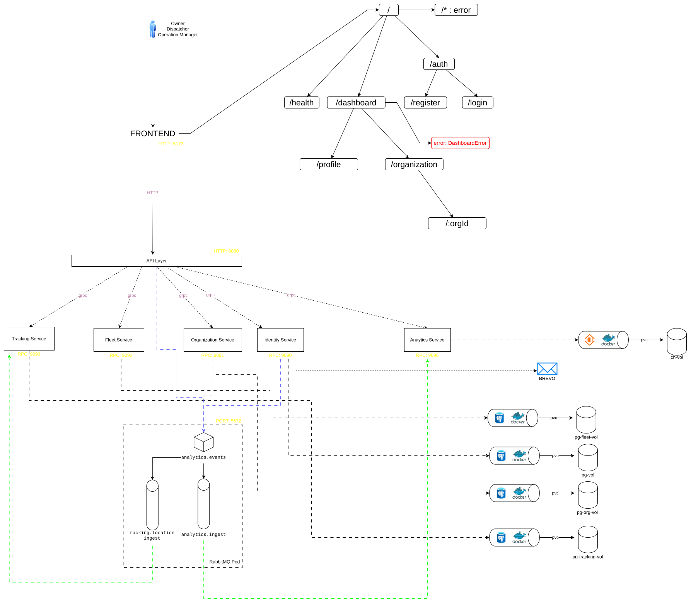

# RoutePulse

RoutePulse is a fleet and trip management platform built as a microservices system. It combines identity, organization management, fleet operations, trip tracking, analytics, a REST API gateway, and a React dashboard.

The project is focused on production-style backend design as much as product functionality: isolated services, gRPC communication, asynchronous event processing, separate transactional and analytical storage, and Kubernetes-based local development.

## What Is In This Repo

RoutePulse currently includes:

- User registration, login, email verification, and password reset flows
- Organization creation, membership listing, invitations, role updates, and member removal
- Fleet management for vehicles and drivers
- Trip creation, trip lifecycle actions, and route preview
- Trip tracking with current location, history, and geometry endpoints
- Live tracking pages in the web dashboard
- Analytics backed by ClickHouse for operational counters and recent activity
- A REST API gateway in front of internal gRPC services
- RabbitMQ for asynchronous event delivery

## Architecture Overview



### Core services

- `api-gateway`: Public HTTP entrypoint, Swagger docs, auth middleware, rate limiting, metrics, and WebSocket ingestion for tracking updates
- `identity-service`: User accounts, password hashing, JWT issuance, email verification, and password reset
- `organization-service`: Organizations, membership, invitations, and role management
- `fleet-service`: Vehicles, drivers, trips, and route preview
- `tracking-service`: Stores and serves trip location history, current location, and route geometry
- `analytics-service`: Consumes events and serves dashboard metrics and recent activity

### Communication model

- External clients talk to the API gateway over HTTP
- Internal services communicate over gRPC
- RabbitMQ is used for asynchronous events
- Analytics writes go to ClickHouse
- Transactional service data lives in PostgreSQL, one database per service boundary

### Storage layout

- PostgreSQL: identity, organization, fleet, tracking
- ClickHouse: analytics events and read-heavy operational metrics

## Key Flows

### Authentication and user lifecycle

1. The frontend sends auth requests to the API gateway.
2. The gateway forwards them to `identity-service` over gRPC.
3. The identity service persists users in PostgreSQL, sends verification/reset emails, and issues JWTs on login.
4. Login and verification events are published to RabbitMQ for analytics ingestion.

### Organization management

1. Authenticated users create organizations through the gateway.
2. The gateway resolves the current user from the JWT.
3. `organization-service` stores the organization and membership state in PostgreSQL.
4. Organization domain events are published for analytics and downstream consumers.

### Fleet and trip operations

1. Authenticated users create vehicles, drivers, and trips through the gateway.
2. `fleet-service` validates ownership and availability before creating trips.
3. Route preview is fetched from the public OSRM demo API and returned to the client.

### Live tracking

1. The dashboard opens a WebSocket connection to the gateway.
2. Tracking payloads are published by the gateway to RabbitMQ.
3. `tracking-service` consumes those events and stores location updates in PostgreSQL.
4. The dashboard reads current location, history, and route geometry through REST endpoints exposed by the gateway.

Note: the current live tracking demo uses browser-generated mock location updates from the frontend rather than a separate mobile/driver device integration.

## API Surface

The API gateway exposes REST endpoints under `/v1`.

### Authentication

- `POST /v1/authentication/register-user`
- `POST /v1/authentication/verify-email`
- `POST /v1/authentication/login`
- `POST /v1/authentication/forgot-password`
- `PUT /v1/authentication/reset-password`
- `GET /v1/user/me`

### Organizations

- `POST /v1/organizations`
- `GET /v1/organizations`
- `GET /v1/organizations/{orgId}`
- `GET /v1/organizations/{orgId}/members`
- `POST /v1/organizations/{orgId}/invite`
- `DELETE /v1/organizations/{orgId}/members/{userId}`
- `PUT /v1/organizations/{orgId}/members/{userId}/role`

### Fleet

- `POST /v1/fleet/vehicles`
- `GET /v1/fleet/vehicles`
- `GET /v1/fleet/vehicles/all`
- `GET /v1/fleet/vehicles/{vehicleId}`
- `PUT /v1/fleet/vehicles/{vehicleId}`
- `PATCH /v1/fleet/vehicles/{vehicleId}/status`
- `POST /v1/fleet/drivers`
- `GET /v1/fleet/drivers`
- `PUT /v1/fleet/drivers/{driverId}`
- `PATCH /v1/fleet/drivers/{driverId}/status`
- `POST /v1/fleet/trips`
- `POST /v1/fleet/trips/preview-route`
- `GET /v1/fleet/trips`
- `GET /v1/fleet/trips/all`
- `POST /v1/fleet/trips/{tripId}/start`
- `POST /v1/fleet/trips/{tripId}/complete`

### Tracking

- `GET /v1/tracking/trips/{tripId}/current`
- `GET /v1/tracking/trips/{tripId}/history`
- `GET /v1/tracking/trips/{tripId}/geometry`
- `GET /v1/ws/driver-tracking`
- `GET /v1/ws/dispatch-tracking`

### Analytics

- `GET /v1/analytics/vehicles-in-transit`
- `GET /v1/analytics/trips-today`
- `GET /v1/analytics/total-members`
- `GET /v1/analytics/active-users-today`
- `GET /v1/analytics/recent-activity`

### Docs and health

- `GET /v1/health`
- `GET /v1/swagger/*` in development mode
- `GET /metrics`

## Frontend

The React app lives in `frontend/web` and includes:

- A landing page
- Auth screens for login and registration
- A dashboard with sections for analytics, organizations, fleet, shipments, and trips
- A driver console and a live trip tracking page built with Leaflet

Important dashboard routes include:

- `/dashboard`
- `/dashboard/organization`
- `/dashboard/fleet/vehicles/all`
- `/dashboard/fleet/drivers/all`
- `/dashboard/analytics`
- `/dashboard/trip`
- `/dashboard/trip/create`
- `/dashboard/trip/driver-console`
- `/dashboard/trip/:tripId/live`

## Repository Layout

```text
.
├── frontend/web                  # React + Vite dashboard
├── infra/development             # Dockerfiles, Tilt, Kubernetes manifests
├── proto                         # Source protobuf definitions
├── services
│   ├── api-gateway
│   ├── analytics-service
│   ├── fleet-service
│   ├── identity-service
│   ├── organization-service
│   └── tracking-service
├── shared                        # Shared env, logger, RabbitMQ, generated protobuf code
├── ProjectDocumentation          # Architecture assets
└── Makefile                      # Protobuf generation
```

## Local Development

### Prerequisites

- Go `1.24.x`
- Node.js and npm
- Docker
- Kubernetes
- Tilt
- `protoc` plus Go protobuf plugins if you need to regenerate generated code

### Start the backend stack

The repo is set up for Tilt-driven local development on Kubernetes:

```bash
tilt up
```

This brings up:

- API gateway
- Identity, organization, fleet, tracking, and analytics services
- PostgreSQL instances for transactional services
- ClickHouse
- RabbitMQ
- Migration jobs
- The web deployment manifest for Kubernetes-based frontend runs

Common forwarded ports from the Tilt config:

- `8080`: API gateway
- `15672`: RabbitMQ management UI
- `15432`: identity PostgreSQL
- `15433`: organization PostgreSQL
- `15434`: fleet PostgreSQL
- `15435`: tracking PostgreSQL
- `18123`: ClickHouse HTTP

### Run the frontend locally with Vite

```bash
cd frontend/web
npm install
npm run dev
```

By default the frontend expects the API gateway to be available at `http://localhost:8080`.

Useful frontend environment variables:

- `VITE_BACKEND_API_URL`
- `VITE_BACKEND_WS_URL`

### Regenerate protobuf code

```bash
make generate-proto
```


## Event-Driven Pieces

RabbitMQ is used for asynchronous communication in two main areas:

- Domain and activity events for analytics ingestion
- Tracking location updates flowing from gateway WebSockets into `tracking-service`

Event names in the shared RabbitMQ contracts include:

- `identity.user.registered`
- `identity.user.email_verified`
- `identity.user.logged_in`
- `organization.organization.created`
- `organization.member.added`
- `organization.member.removed`
- `organization.member.role_updated`
- `tracking.driver.location_updated`

## Current Limitations and Honest Notes

This repository includes a few pieces that are present but not fully wired into the main application path yet:

- OpenFGA deployment manifests exist, but fine-grained authorization is not integrated into the request flow yet
- Some roadmap items are left as comments in the API gateway and are not implemented yet, such as logout, MFA, profile update, and avatar support
- Route preview depends on the public OSRM demo service
- Live trip tracking currently uses simulated browser-side updates for demo purposes
- There is no CI pipeline definition in this repository at the moment
- Automated tests are not present yet in the current codebase

## Tech Stack

- Go for backend services
- gRPC + Protocol Buffers for internal APIs
- Chi for the API gateway
- React + Vite for the web frontend
- RabbitMQ for messaging
- PostgreSQL for transactional storage
- ClickHouse for analytics
- Docker, Kubernetes, and Tilt for local infrastructure and deployment workflows

## What To Improve Next

The most natural next steps for this codebase are:

- Add automated tests across service and API boundaries
- Replace demo tracking ingestion with a real driver/mobile publisher
- Finish authorization work, potentially with OpenFGA
- Add CI for linting, builds, migrations, and smoke tests
- Expand analytics beyond counters into richer operational reporting
