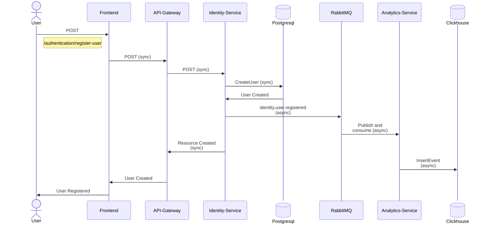
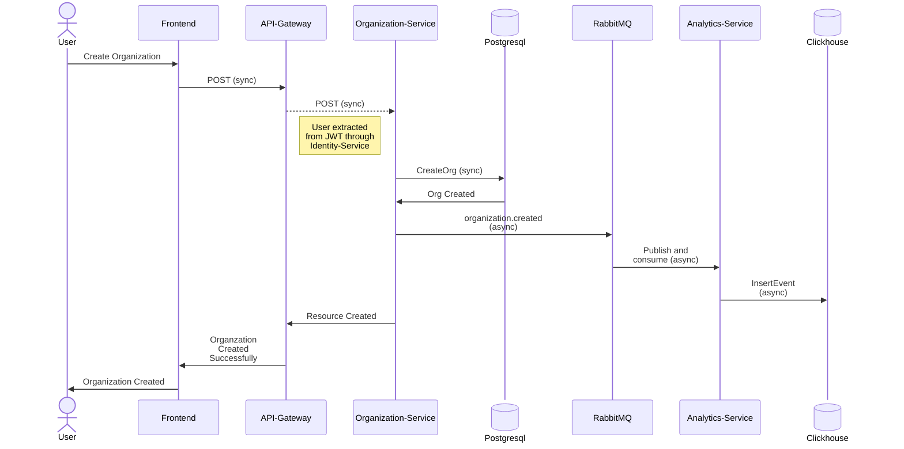

# RoutePulse

## Table of Contents
- [Problem Statement](#problem-statement)
- [Architecture Overview](#architecture-overview)
- [System Overview](#system-overview)
- [Request Flow](#request-flow)
- [Design Decisions & Trade-offs](#design-decisions--trade-offs)
- [Event-Driven Architecture](#event-driven-architecture)
- [Observability](#observability)
- [Failure Scenarios](#failure-scenarios)
- [Security Model](#security-model)
- [Performance & Scale](#performance--scale)
- [Local Development](#local-development)
- [Deployment & CI/CD](#deployment--cicd)
- [What I’d Improve Next](#what-id-improve-next)

## Problem Statement

Fleet and logistics backends often begin with basic features authentication, organizations, trip tracking but quickly become tightly coupled and difficult to scale or maintain.

**RoutePulse models a production-oriented fleet management backend** with:

- Clear service boundaries (Identity, Organization, Analytics)
- A thin API Gateway for orchestration
- gRPC for internal service communication
- Event-driven analytics processing
- Built-in observability and rate limiting

The focus is not only functionality, but system design:

- Safe and efficient service-to-service communication  
- Explicit handling of failure (timeouts, rate limits, graceful shutdown)  
- Strong authentication and request isolation  
- Separation of transactional and analytics workloads  
- Horizontal scalability without tight coupling  

RoutePulse is designed to reflect how a real backend should behave under production constraints.

## Architecture Overview

### 1. High-Level Architecture Diagram

**RoutePulse is a distributed microservices system deployed on Kubernetes.**

> ### Why Mircoservices? 
> This system is intentionally designed to simulate production-like service boundaries, failure isolation, and independent scaling.

### The architecture is structured into four logical layers:

1. **The Edge Layer** \
Serves as the single entry point for all external client requests. Transforms incoming HTTP requests into strongly-typed internal gRPC calls. Core services remain internal and are never directly exposed to external clients.

2. **Core Services Layer** \
Core domain logic is split into independent gRPC services: \
**Identity Service** – authentication, users \
**Organization Service** – org boundaries and membership \
**Analytics Service** – event ingestion and reporting 
<!-- **Trip Service** \
**Fleet Service** \
**Tracking Service** -->

> **NOTE:** Each service has its own database to enforce isolation.

3. **Messaging Layer** \
RabbitMQ is used for asynchronous workflows. It is used to asynchronously publish events for the analytics service.

4. **Data Layer** \
Two storage strategies are used: \
**PostgreSQL** → transactional workloads (identity, organization) \
**ClickHouse** → analytical workloads (high-volume event ingestion)

## Request Flow

### 1. User Registration

- The client sends a registration request to the API Gateway.
- The Gateway forwards the request to the Identity Service via gRPC.
- The Identity Service stores the user in PostgreSQL and returns a success response.
- After persistence, an identity.user.registered event is published to RabbitMQ.
- The Analytics Service consumes the event and stores it in ClickHouse asynchronously. \
> The client response is not blocked by analytics processing, ensuring low latency and loose coupling.

### 2. Organization Creation

- The client sends a create-organization request to the API Gateway.
- The Gateway authenticates the user via JWT and forwards the request to the Organization Service via gRPC.
- The Organization Service persists the organization in PostgreSQL and returns a success response.
- After persistence, an organization.created event is published to RabbitMQ.
- The Analytics Service consumes the event and stores it in ClickHouse asynchronously. \
> The organization is created synchronously, while analytics processing remains decoupled and non-blocking.

## Design Decisions & Trade-offs

## Event-Driven Architecture

## Observability

## Failure Scenarios

## Security Model

## Performance & Scale

## Local Development

## Deployment & CI/CD

## What I’d Improve Next

