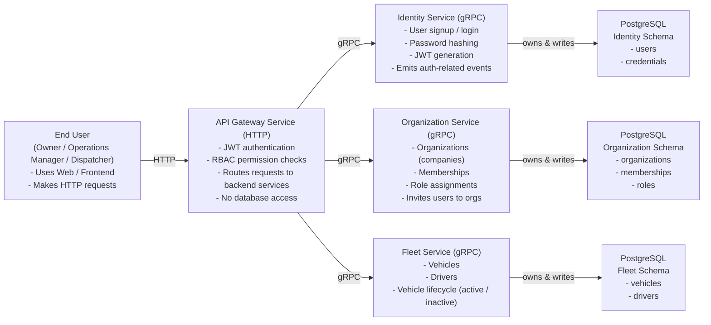
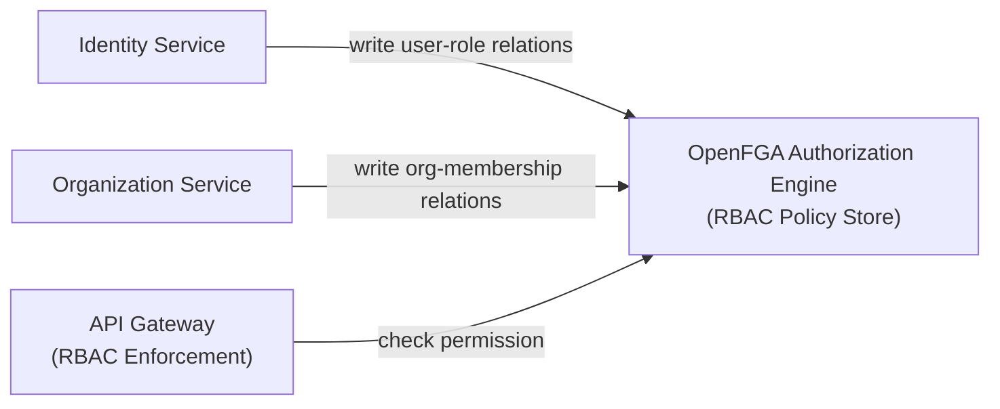
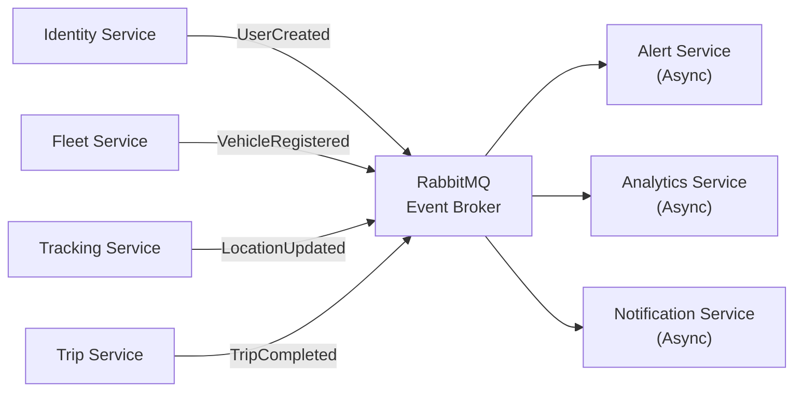

# Core services & data ownership
Who talks to whom synchronously, and who owns which data?

# Authorization & RBAC (OpenFGA only)
How permissions are written and checked

# Async events & RabbitMQ
Who publishes events, who consumes them, and why
